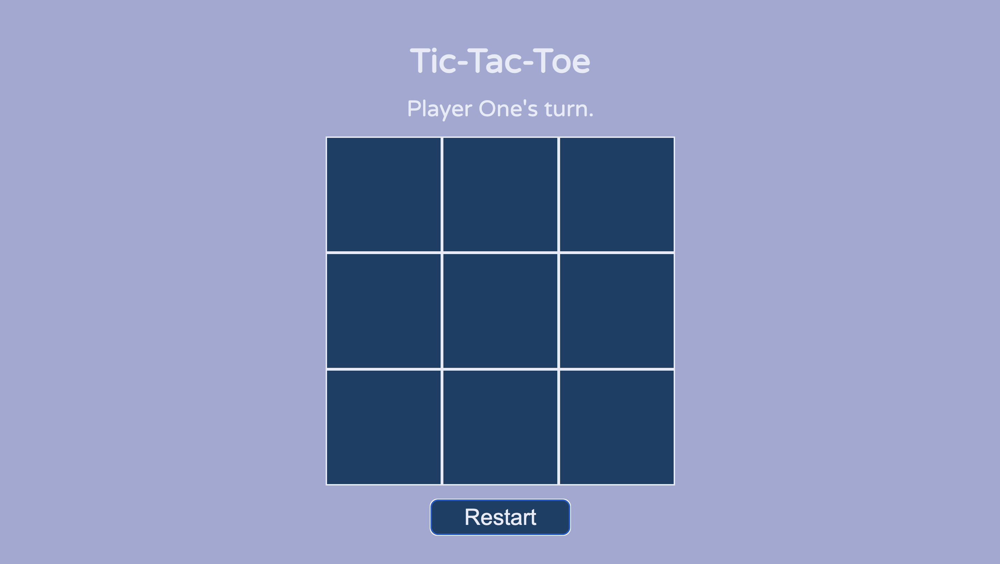

# Tic Tac Toe

This project is a tic-tac-toe game you can play in your browser. You can play the game at https://lucasbpaiva.github.io/tic-tac-toe/

In this project I practiced the module pattern by writing different parts of the code inside their own functions, with as little global code as possible. This made me think about the separation of front end code used to manipulate the DOM and the back end functions storing the logic of the game itself. By writing distinct functions for each of these parts I felt the code became easier to debug, especially in the front end, because the game was already playable on the console and the code I was writing at that point (for manipulting the DOM) didn't even have access to alterate the logic of the game.